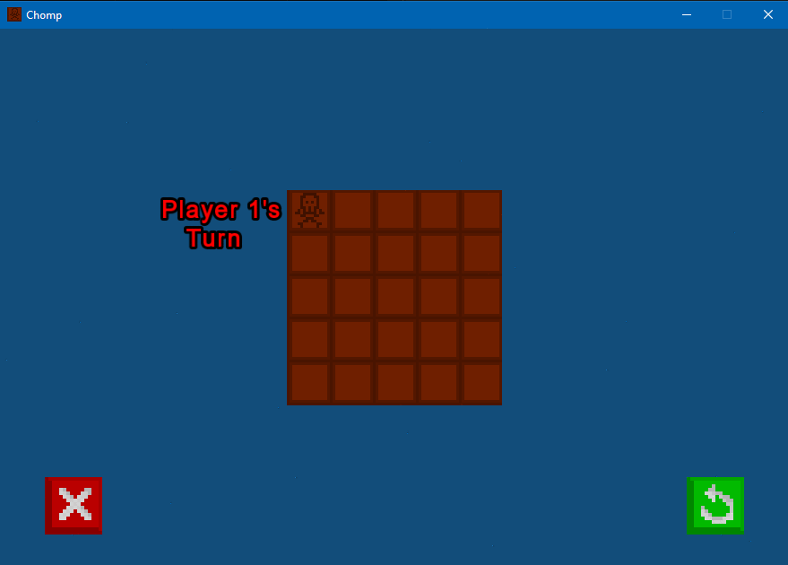
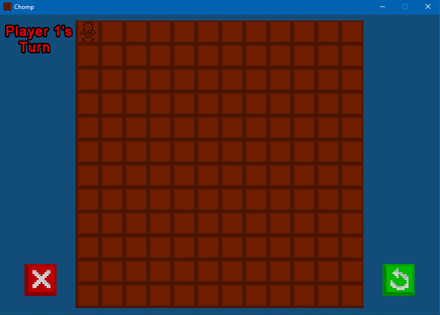

# ChompGame
According to Wikipedia: "Chomp is a two-player strategy game played on a rectangular grid made up of smaller square cells, which can be thought of as the blocks of a chocolate bar. The players take it in turns to choose one block and "eat it" (remove from the board), together with those that are below it and to its right. The top left block is "poisoned" and the player who eats this loses."

This is my first project using SFML libraries. I converted to the project to SFML in a single day so the code is quite messy. I should have used more OOP style programming
which I will do in the future, but this project was mainly to learn and test out all the features that SFML brings.

<b>
  Customizable size of the game board!
</b>

  
 
<b>
  Gameplay
</b>

  
